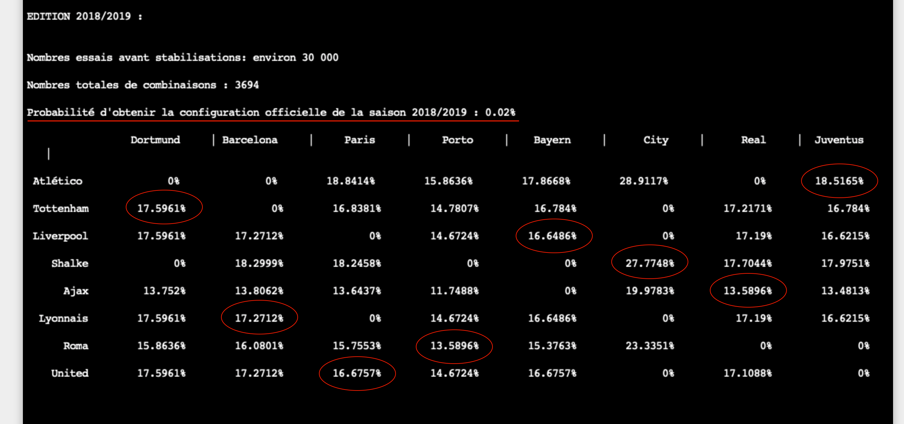
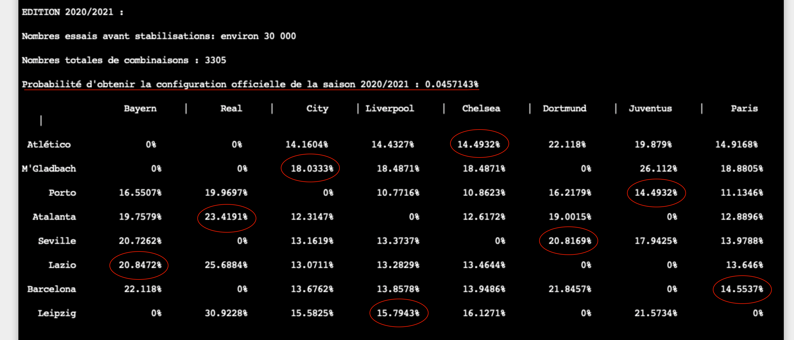

# UEFA Champions League Draw

**UEFA Champions League Draw is an academic project in C++ at the University of Paris-Saclay in 2021.**

## Subject

The **UEFA Champions League** is an international football competition in which the best European clubs compete. During a first phase called "Group Phase", the teams are divided into 8 groups. Matches are held within each group to d ́ecide a ranking: the first and second of each group are s ́elected for the final phase. We thus have 16 teams, each team belonging to a group (A, B, C, D, E, F, G, H) and with a ranking (1st or 2nd). At the end of this phase, in December, the draw takes place to decide on the 8 matches that will make up the round of 16. The aim of the project is to study this draw following the UEFA rules.
The rules are as follows:  
>1) Each match is constituted by a first-place team and a second-place team.
>2) Each match shall consist of two teams from different groups. 
>3) Two teams from the same country may not play each other in the round of 16.

## Task 
**Monte Carlo method** 
The principle of this method is to simulate the UEFA draw a large number of times and to derive an approximate value of the probabilities associated with each configuration. 
The approximate probability of obtaining a configuration is given by:  
$\frac{\text{Number of times I got the pattern}}{\text{Number of draws made}}$

## Result for several season

